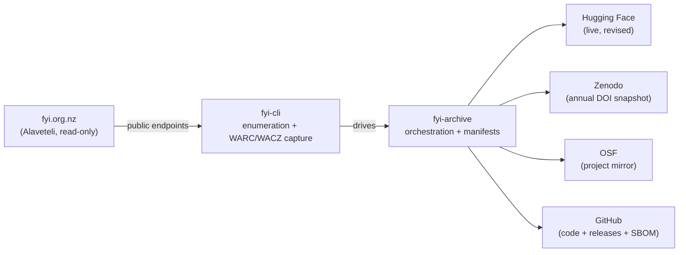

# fyi-archive

> Work in progress toward a **read-only, full-site archive** of [fyi.org.nz](https://fyi.org.nz/) — the New
> Zealand Official Information Act (OIA) request register (Alaveteli) — into
> **GitHub**, **Hugging Face**, **Zenodo**, and **OSF**.

[](https://github.com/edithatogo/fyi-archive/actions/workflows/tests.yml)
[](https://github.com/edithatogo/fyi-archive/actions/workflows/code_quality.yml)
[](https://www.python.org/)
[](https://github.com/astral-sh/ruff)
[](LICENSE)



## Architecture (two-repo split)

| repo | role |
| --- | --- |
| [`fyi-cli`](https://github.com/edithatogo/fyi-cli) | **Capture tool.** Owns all network access: full-site enumeration, faithful WARC/WACZ capture (request JSON, rendered HTML, attachments), content-addressed dedup, archival content diff, archive health. |
| **`fyi-archive`** (this repo) | **Orchestration + distribution.** Thin consumer of `fyi-cli` commands. Planned scope includes historical seed, daily sync, multi-mirror publish, mirror adapters (HF/Zenodo/OSF), metadata (Croissant/Frictionless), DuckDB export, versioning/releases, and provenance. Contains **no** fetching/archiving logic. |

## Initial phase — read-only storage

The first phase is **storage only**: capture and mirror the public site faithfully,
with **no** analysis, OCR, or normalisation. (Those are future tracks.)

## Current status

This repository contains the orchestration layer, CI/quality gates,
release-please scaffolding, historical seed and prospective sync commands,
multi-mirror publisher adapters, mirror verification evidence, and a preliminary
`doctor` command. It does **not** keep full archive payloads in git; data lives on
the mirrors and only small manifests/evidence files are stored here.

## Directory structure

```text
fyi-archive/
├── src/fyi_archive/      # orchestration CLI + mirror adapters (thin)
├── scripts/              # version consistency, SBOM
├── tests/
├── schemas/              # manifest, changes, croissant JSON Schemas
├── metadata/             # Croissant / Frictionless / schema.org (generated)
├── manifests/            # committed schema + placeholders (data lives on mirrors)
├── docs/                 # architecture, ethics, provenance
├── data/   (gitignored)  # raw WARC/WACZ + derived records + sync state
├── dist/   (gitignored)  # release bundles, DuckDB, SBOM, provenance
├── versions/             # committed monthly mirror verification evidence
└── .github/workflows/    # CI, sync, publish, release, security
```

## Data sources

| source | status | capture |
| --- | --- | --- |
| `fyi.org.nz` requests | target | JSON + HTML + attachments → WARC/WACZ (via `fyi-cli`) |
| `fyi.org.nz` authorities (bodies) | target | bodies spreadsheet → `manifests/authorities.json` |
| `fyi.org.nz` search feeds | target | advanced-search Atom/JSON feeds for enumeration |

## Distribution channels

| channel | role | cadence |
| --- | --- | --- |
| **Hugging Face** (`edithatogo/fyi-archive-nz`) | live, content-revised dataset | daily sync + monthly publish |
| **Zenodo** | DOI snapshot, draft-first and gated | manual/annual DOI snapshot; monthly draft verification available |
| **OSF** | project + components mirror | optional monthly publish |
| **GitHub Releases** | code releases via release-please with SBOM/provenance | per release |

`fyi-archive publish verify` verifies local manifests/artifacts against remote
Hugging Face, Zenodo, and OSF evidence, then writes:

- `dist/mirror_verification.json` for the current job artifact bundle.
- `versions/<YYYY-MM>/mirror_verification.json` for repository history.
- `versions/latest_mirror_verification.json` for the current known mirror state.

Archive publication versions are dynamic monthly identifiers of the form
`<package-version>+archive.<YYYY.MM>`, distinct from package SemVer.

## Workflows

| workflow | purpose |
| --- | --- |
| `tests.yml` / `code_quality.yml` | CI: ruff, ty, pytest+cov, typos, taplo, actionlint, zizmor |
| `archive_health_monitor.yml` | scheduled preliminary archive health report |
| `validate_metadata.yml` | metadata parity-count check |
| `automated_historical_backfill.yml` | scheduled controller that dispatches bounded historical backfill workers and persists progress in a GitHub issue |
| `historical_seed.yml` / `merge_backfill_artifacts.yml` | manual/automated historical backfill workers and merged manifest artifacts |
| `hf_sync.yml` | daily incremental sync to HF, with SHA-256 verify |
| `publish_archives.yml` | monthly multi-mirror publish (HF/Zenodo/OSF), verification, versioned evidence, build provenance |
| `zenodo_publish.yml` | gated Zenodo DOI citation update (`environment: zenodo-production`) |
| `release.yml` | release-please SemVer + changelog + GitHub Release |
| `codeql.yml` / `scorecard.yml` | security |
| `mirror_sync.yml` | push to secondary git mirror |

## Required GitHub Actions secrets

```env
HF_TOKEN
ZENODO_TOKEN
ZENODO_SANDBOX_TOKEN        # optional, for draft rehearsal
OSF_TOKEN
GIT_MIRROR_SSH_PRIVATE_KEY  # if secondary mirror enabled
```

## Repository variables

```env
HF_REPO_ID            = edithatogo/fyi-archive-nz
FYI_ARCHIVE_BASE_URL  = https://fyi.org.nz
ARCHIVE_TITLE         = fyi-archive (fyi.org.nz OIA register)
ARCHIVE_LICENSE       = MIT
```

See [`.env.example`](.env.example) for the local-run equivalents.

## Local setup

```bash
uv sync --extra dev          # from the lockfile
uv run pytest -q
make quality                 # ruff + ty + typos + taplo + actionlint + zizmor
```

> `fyi-cli` is referenced as a local path dependency (`../fyi-cli`); clone it
> alongside this repo inside the `legal-nz` workspace.

## Maintenance checklist

- **Weekly:** review automated backfill progress, archive health, and mirror parity.
- **Monthly:** review Renovate PRs; rotate any tokens nearing expiry.
- **Annually:** trigger the planned Zenodo DOI snapshot workflow; update `CITATION.cff`.

## Ethics & compliance

Read-only capture only. Rate-limited, `robots.txt`-aware, contactable `User-Agent`.
See [`docs/ethics-and-compliance.md`](docs/ethics-and-compliance.md) and
[`NOTICE.md`](NOTICE.md).

**This archive is not collected for AI training or LLM development.** It is a
non-commercial research project for preserving public information and supporting
transparency. Each instance runs at a deliberately slow pace (1 request/second,
2 concurrent) to minimise impact on source sites.

## License

[MIT](LICENSE). Archived content remains © its respective contributors / fyi.org.nz;
this project preserves it for research and transparency only.

## Related projects

| repo | description |
| --- | --- |
| [`fyi-cli`](https://github.com/edithatogo/fyi-cli) | Capture tool (enumeration + WARC/WACZ) |
| [`corpus-law-nz`](https://github.com/edithatogo/corpus-legislation-nz) | NZ legislation corpus |
| [`corpus-nz-hansard`](https://github.com/edithatogo/corpus-nz-hansard) | NZ Hansard corpus |
| [`hathi-nz`](https://github.com/edithatogo/hathi-nz) | HathiTrust NZ corpus |
| [`sm-govt-nz`](https://github.com/edithatogo/sm-govt-nz) | NZ govt social-media archive |
