# Design (Mermaid)

Derived from [`requirements.md`](./requirements.md). Diagrams are the authoritative
design reference; prose clarifies intent only. (`docs/README.md` holds the
user-facing architecture summary; this file holds the full design.)

## 1. System architecture — two-repo responsibility split

`fyi-cli` owns **all** network access and capture; `fyi-archive` owns orchestration +
distribution only. Nothing in `fyi-archive` fetches from the network.

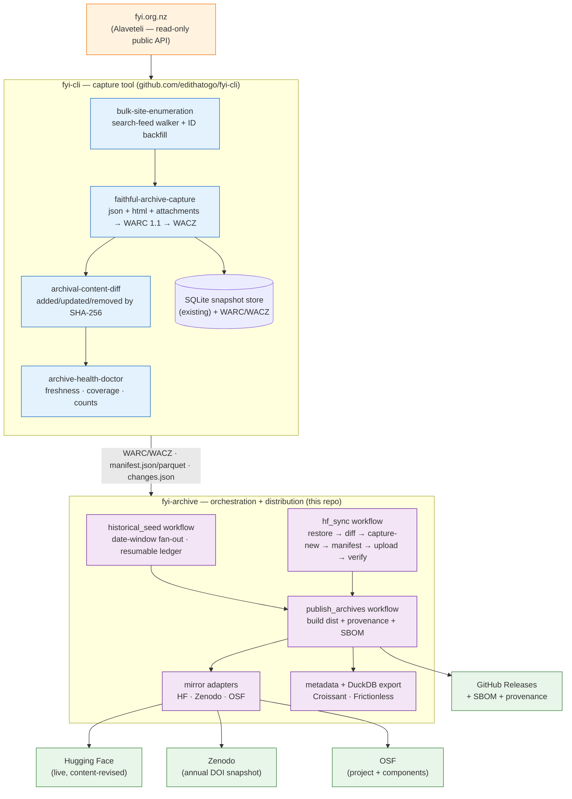

## 2. Data model — WARC/WACZ as source of truth

WARC is the archival source of truth; the SQLite snapshot store, the per-request
derived view, and the manifest are all projections over it.

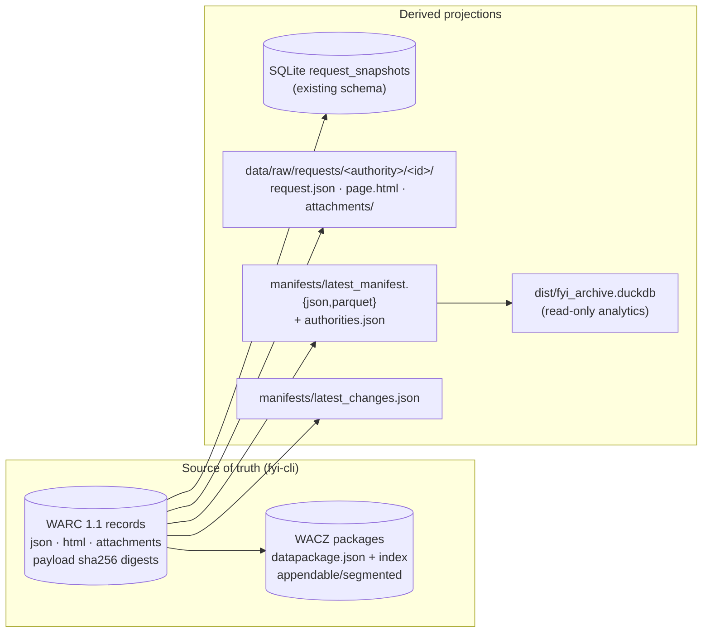

## 3. Historical seed — resumable, date-windowed, capped

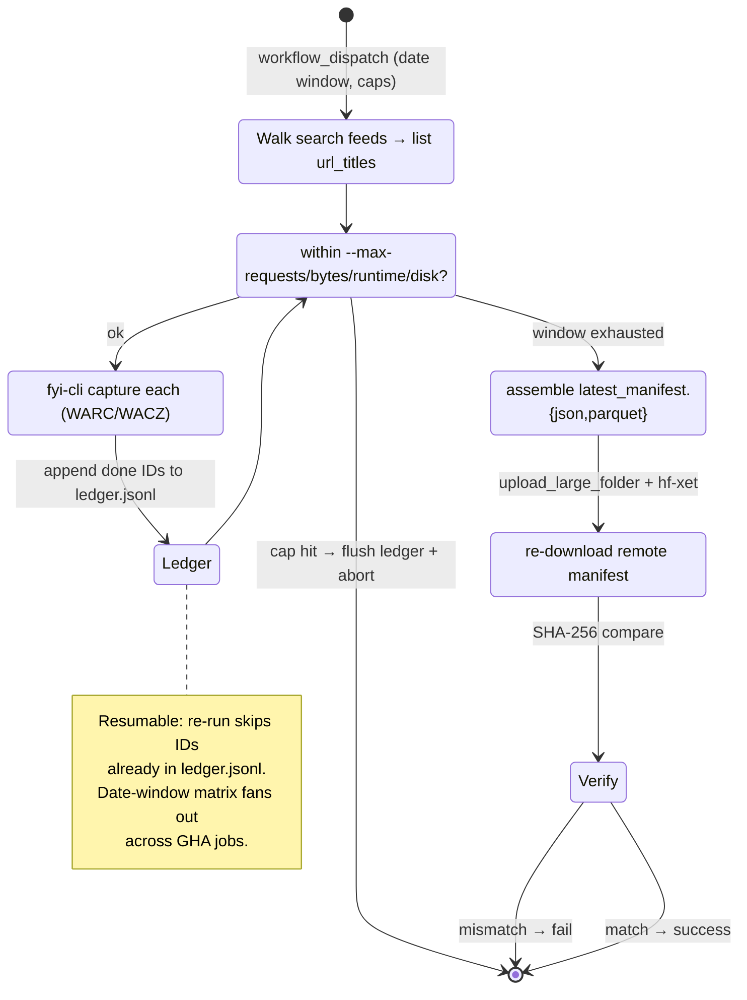

## 4. Prospective sync — daily, content-addressed

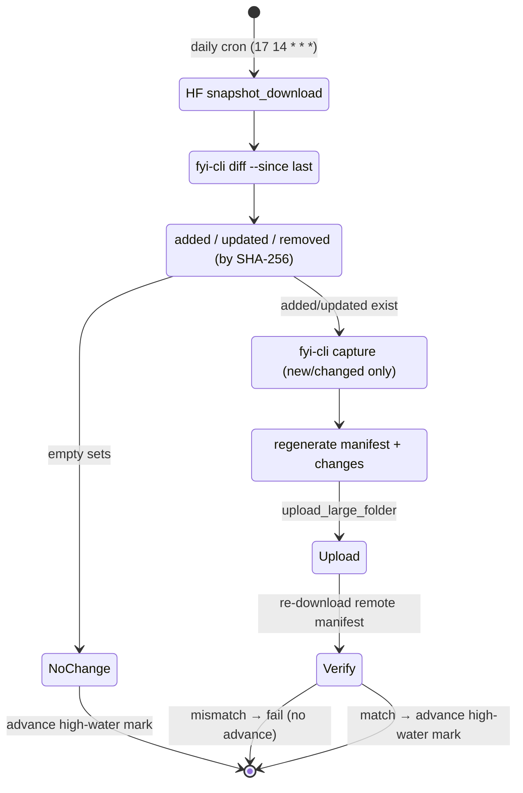

## 5. Publishing — multi-mirror, draft-first

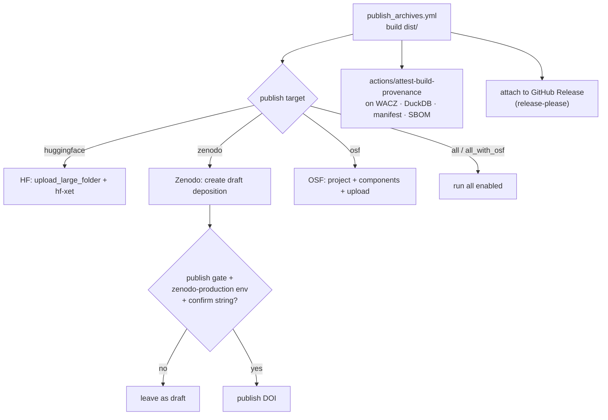

## 6. Versioning & release flow — dynamic, via GHA

SemVer in `pyproject.toml` + `VERSION`, kept in sync by
`check_version_consistency.py`. `release-please` consumes Conventional Commits to
produce bumps, `CHANGELOG.md`, and GitHub Releases automatically.

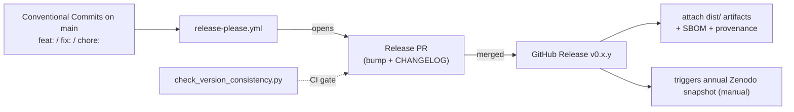

## 7. CI/CD & quality pipeline

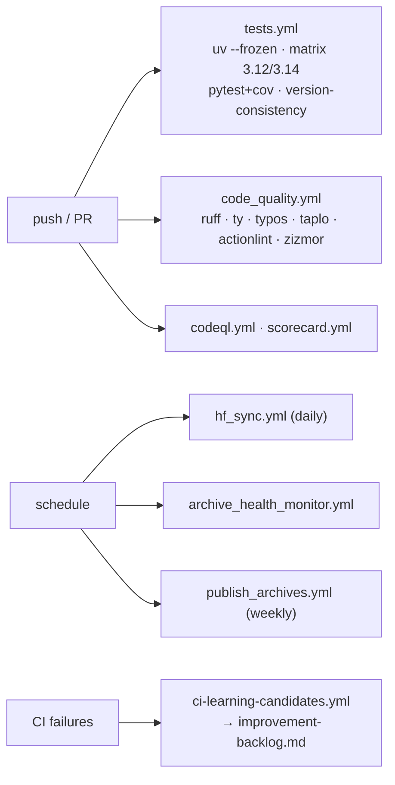

## 8. State & ledger locations

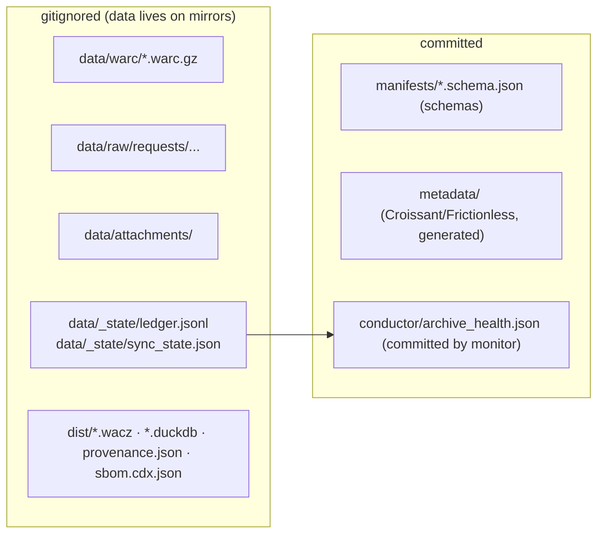

## Design principles

1. **fyi-cli owns the network.** No fetch logic in `fyi-archive` (R-05, R-06, R-41).
2. **WARC/WACZ is the source of truth.** Everything else is a projection (section 2).
3. **Read-only & polite.** Rate-limited, robots-aware, capped (R-02, R-20, R-21, R-42).
4. **Historical before prospective** (R-13 → R-14).
5. **Draft-first, gated publication** (R-22).
6. **Automated, evidence-backed releases** (R-15, R-16, R-24).
7. **Storage-only in phase 1** — no analysis (R-03, R-04, R-28, R-29, R-51).
8. **Instance-aware orchestration** — default `nz-fyi`; multi-instance via config (R-40).
9. **Public-policy research purpose** — not AI training (R-43).

## 9. Multi-instance architecture

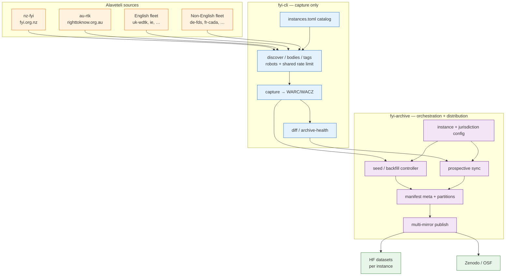

## 10. AU jurisdiction rollout state machine

Right to Know Australia is **one** national Alaveteli instance. Jurisdictions are
body-tag partitions (`NSW_state`, `VIC_state`, …), not separate sites.

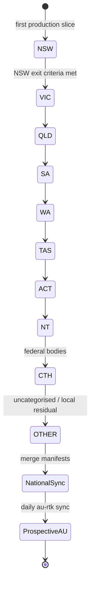

## 11. Global Alaveteli ladder

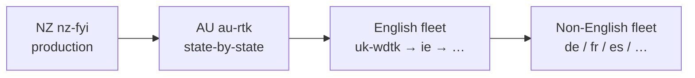

## 12. Multi-instance data layout

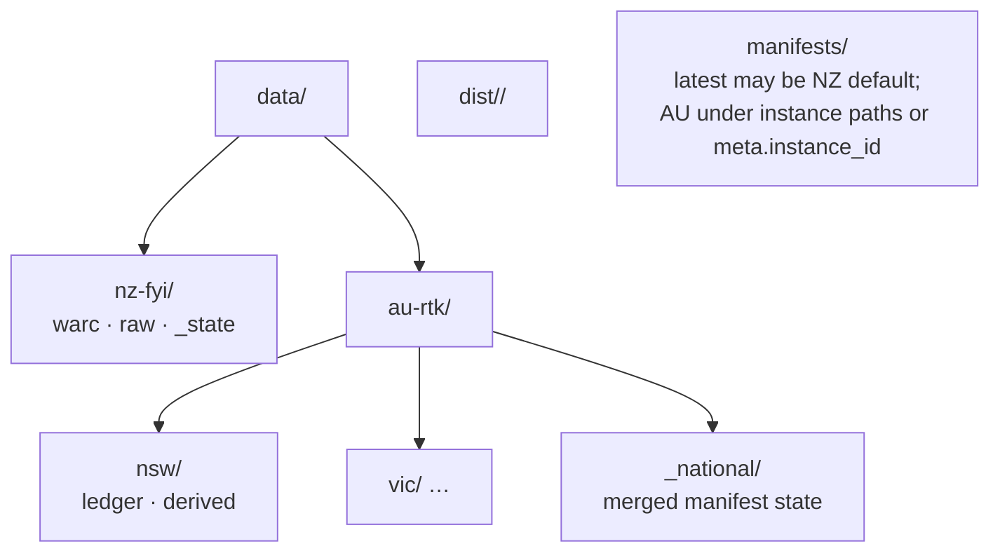

## 13. Conductor track → GitHub project flow

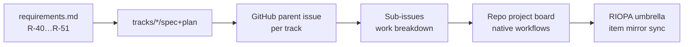
