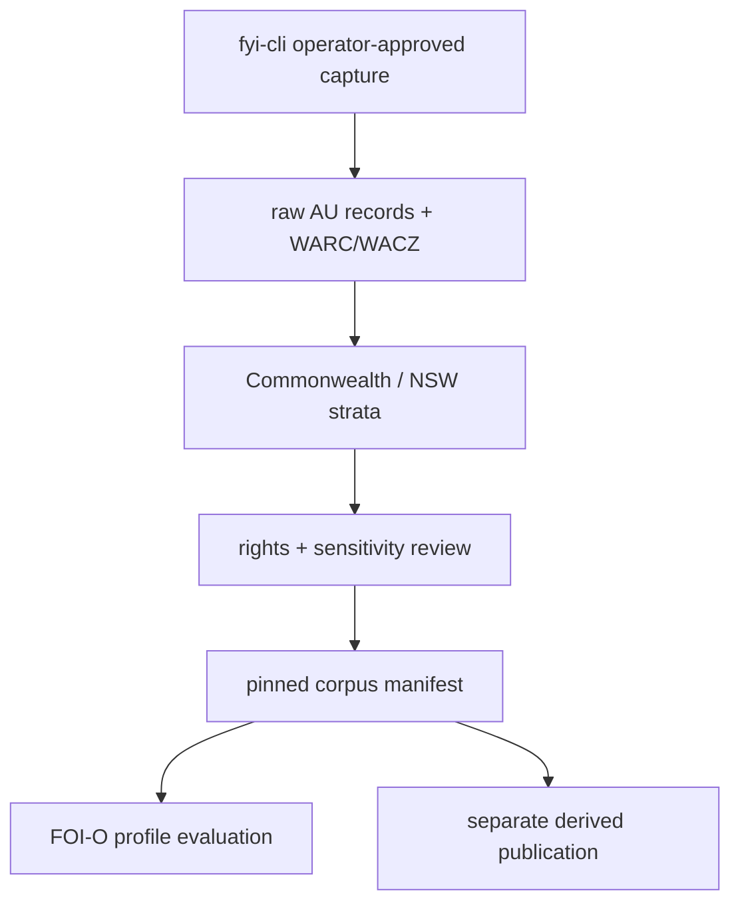

# Design

```mermaid
flowchart TB
  CAPTURE["fyi-cli operator-approved capture"] --> RAW["raw AU records + WARC/WACZ"]
  RAW --> STRATA["Commonwealth / NSW strata"]
  STRATA --> RIGHTS["rights + sensitivity review"]
  RIGHTS --> MANIFEST["pinned corpus manifest"]
  MANIFEST --> FOI["FOI-O profile evaluation"]
  MANIFEST --> DERIVED["separate derived publication"]
```
