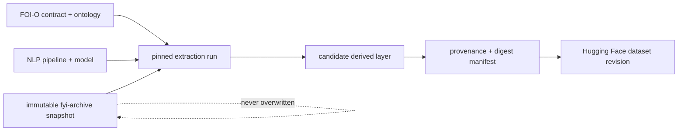

# Design

```mermaid
flowchart LR
  RAW["immutable fyi-archive snapshot"] --> RUN["pinned extraction run"]
  CONTRACT["FOI-O contract + ontology"] --> RUN
  MODEL["NLP pipeline + model"] --> RUN
  RUN --> DERIVED["candidate derived layer"]
  DERIVED --> MANIFEST["provenance + digest manifest"]
  MANIFEST --> HF["Hugging Face dataset revision"]
  RAW -.never overwritten.-> RAW
```
