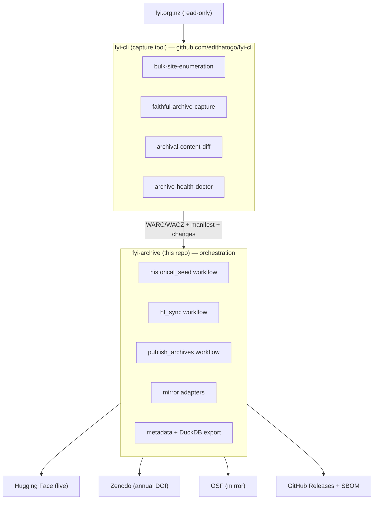

# Architecture

## Responsibility split

### fyi-cli owns all network access

- **`bulk-site-enumeration`** — discover every request via advanced-search Atom/JSON
  feeds (date-windowed, paginated) plus an optional ID-space backfill for gaps.
- **`faithful-archive-capture`** — for each request, capture the JSON payload, rendered
  HTML, and all attachment binaries; write WARC 1.1 records and package into WACZ
  (Webrecorder `py-wacz`); content-address attachments by SHA-256 with cross-request
  dedup.
- **`archival-content-diff`** — compute added/updated/removed between syncs by
  content SHA-256; emit `latest_changes.json`.
- **`archive-health-doctor`** — freshness, coverage gaps, last-successful-sync.

### fyi-archive owns orchestration + distribution only

- Workflows that invoke the above `fyi-cli` commands.
- Mirror adapters (HF `upload_large_folder` + hf-xet; Zenodo deposition API;
  OSF API v2 project + components).
- Croissant + Frictionless metadata, DuckDB read-only export, SBOM, provenance.
- Versioning (release-please), security (CodeQL, Scorecard, zizmor).

## Data flow (storage-only phase)

1. `fyi-cli` enumerates + captures → `data/warc/*.warc.gz`, `data/raw/requests/<id>/`.
2. `fyi-cli` assembles manifest + changes.
3. `fyi-archive` publishes manifest + WACZ + DuckDB to mirrors.
4. HF sync re-downloads remote manifest, verifies SHA-256 against local, fails on
   mismatch.

No analysis, OCR, or normalisation in this phase (explicit non-goal).
